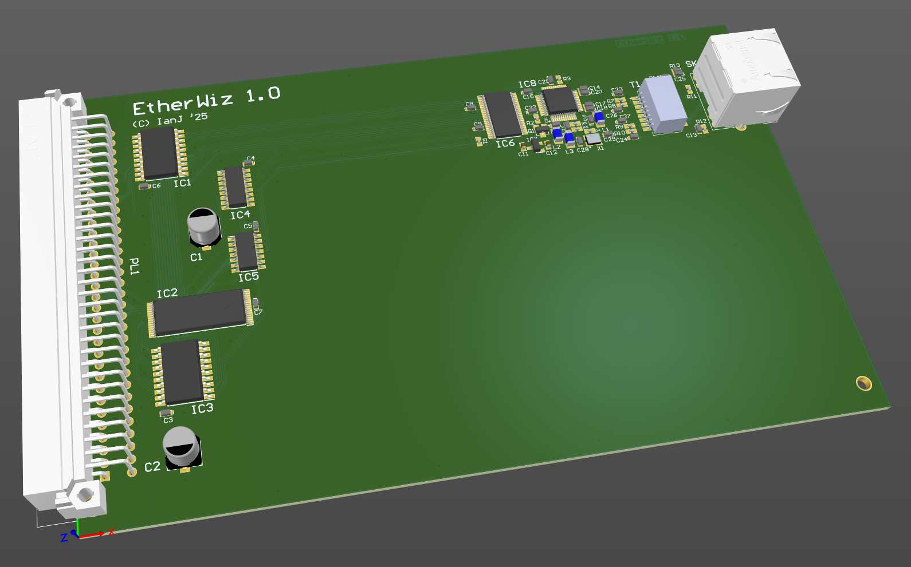
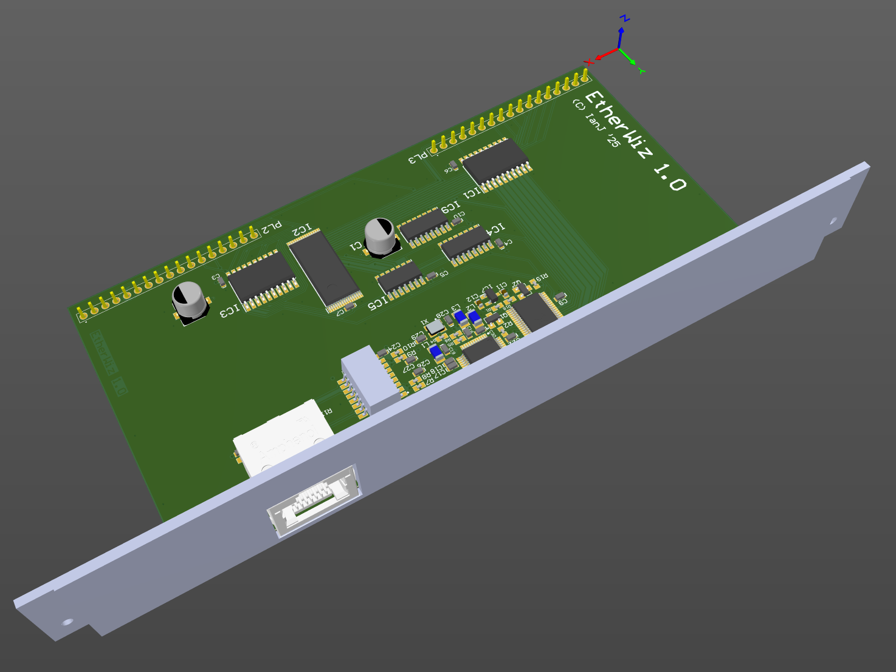

# "EtherWiz" Acorn Ethernet podule (WizNet W6100)

July 2025

A work in progress hardware design for an Ethernet card using the WizNet W6100 device in MACRAW mode.  No 'legacy' components - everything is available as new/active hardware.   There's 512K flash on board rather than a podule ROM - the flash can be updated from RISC OS.

The first spin board works, with bodges, which have been worked in to the updated design which has not yet been validated.  The updated design has also been laid out as a minipodule - also not yet validated.

Interrupts have not yet been tested.

The design for the 3D-printable backplate is included.

All RISC OS code (EtherWiz DCI4 Ethernet driver, podule binder, flashing code) is all my own work, written from scratch in BASIC assembler, OpenSource, and will be made available via GitHub as soon as stable.

## Licence

No warranty is provided, and this work is used at your own risk.  

Licenced as CC BY-SA 4.0

Copyright 2025 Ian Jeffray

