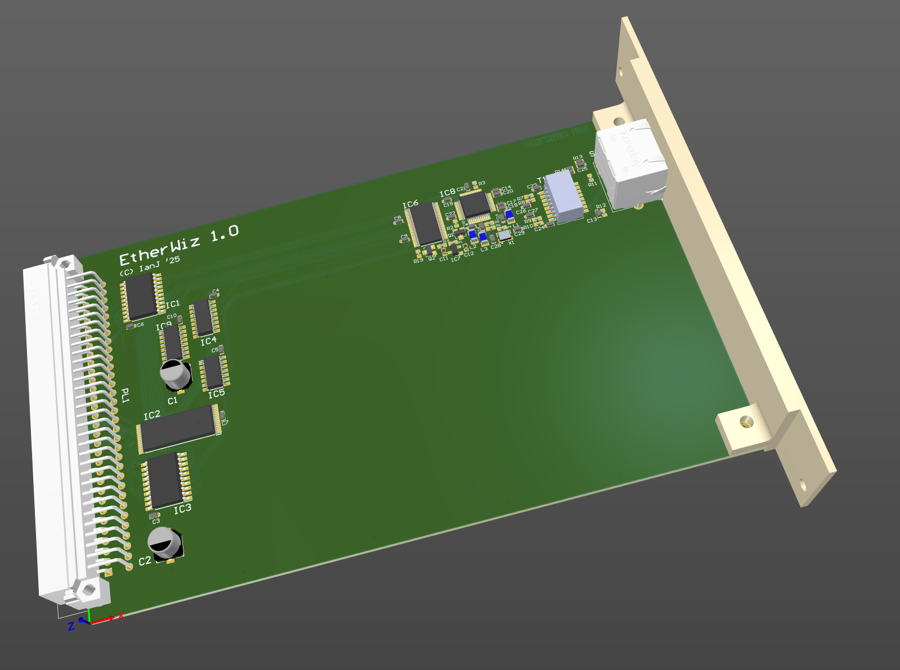

# "EtherWiz" Acorn Ethernet podule (WizNet W6100)

June 2025

Very early work in progress hardware design for an Ethernet card using the WizNet W6100 device in MACRAW mode.

## Licence

No warranty is provided, and this work is used at your own risk.  

Licenced as CC BY-SA 4.0

Copyright 2025 Ian Jeffray

